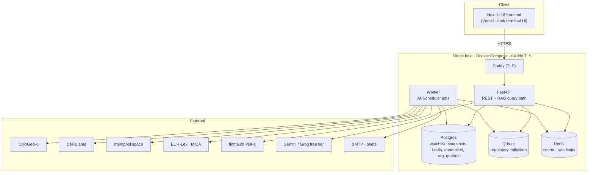
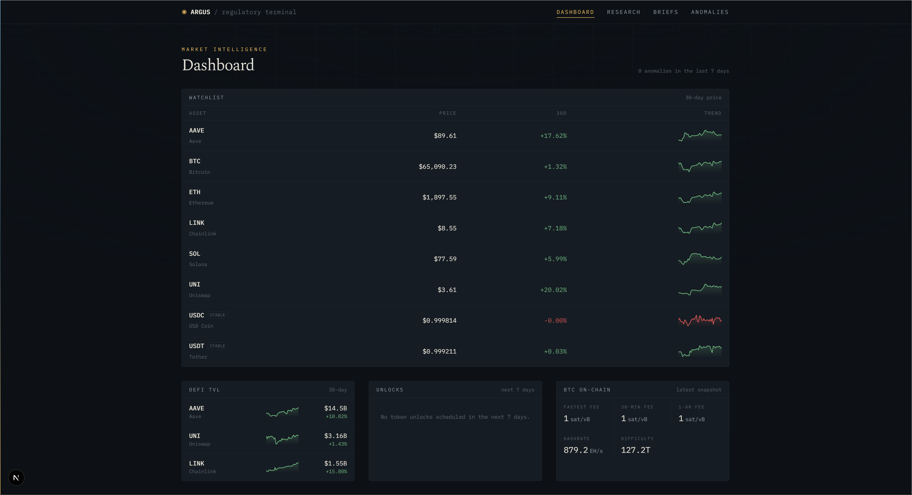
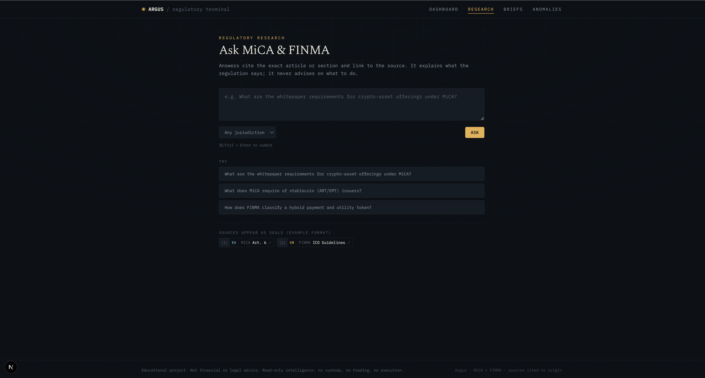
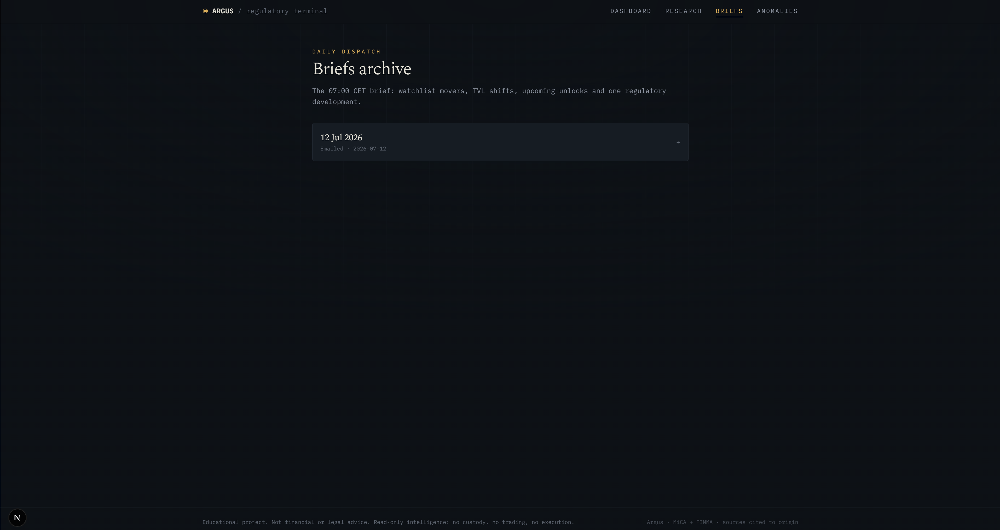
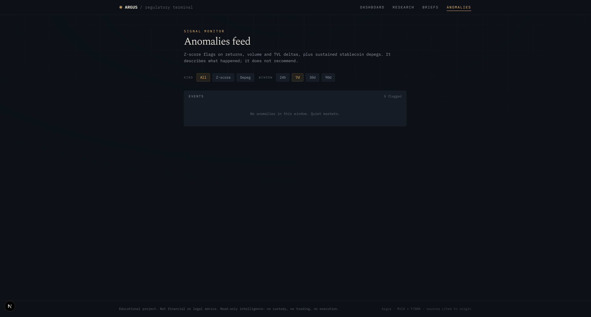

# Argus

**A cited regulatory-research terminal for the regulated crypto world:** live crypto
market data, DeFi fundamentals and BTC on-chain metrics alongside a RAG assistant that
answers MiCA and FINMA questions with **article-level citations that link to the source**.
Educational project, not financial or legal advice.

> **Live demo:** _deploying to Oracle Cloud Always Free (ARM); URL to follow._
> Runs fully locally today with `docker compose up` (see [Setup](#setup)).

Built by [Carolina Kogan Plachkinova](https://github.com/carolina-kp) as a portfolio-grade
project targeting Swiss and Danish digital-asset employers. Two goals drive every decision:
**genuinely useful daily**, and **demonstrably production-grade** at zero infra cost.

---

## Why this exists

The single worst failure mode for a regulatory assistant is a **wrong-but-confident answer**.
Argus is built around avoiding it: every answer cites the exact article or section and links
to the primary source (EUR-Lex, finma.ch), and when retrieval confidence is below threshold
the system **says the corpus doesn't cover the question** instead of inventing one. It explains
what the regulation says; it never advises on what to do.

## What it does

| Pillar | Detail |
| --- | --- |
| **Market intelligence** | CoinGecko prices/market caps, DeFiLlama TVL & fees, mempool.space BTC fees/hashrate/difficulty, a curated token-unlock calendar. |
| **Regulatory RAG** | Cited Q&A over MiCA (Regulation (EU) 2023/1114, all 149 articles), FINMA ICO guidance + stablecoin supplement, and BTC/ETH/AAVE/UNI/LINK whitepapers. |
| **Agents** | A daily brief (movers, TVL shifts, unlocks, one regulatory retrieval), an anomaly scan (z-scores + stablecoin depeg rule), and a weekly incremental re-ingestion of the corpus. |

## Architecture



Local embeddings (bge-small-en-v1.5 via fastembed) mean **zero embedding cost**; the runtime
LLM is a free tier behind a provider switch in `core/llm.py`, so Anthropic models can be
enabled by env var if a budget ever exists.

### Repo layout

```
frontend/   Next.js 16 (TypeScript strict, Tailwind v4, App Router)
api/        FastAPI service (watchlist CRUD, market/on-chain/RAG, briefs, anomalies)
worker/     APScheduler job runner (snapshots, daily brief, anomaly scan, ingestion)
core/       Shared package: config, db, models, data clients, Alembic migrations, prompts
infra/      Caddy edge config, deploy/backup scripts, CloudFormation template
eval/       Citation-accuracy harness for the RAG (run_eval.py)
```

## Screenshots

| Dashboard | Regulatory research |
| --- | --- |
|  |  |

| Daily brief | Anomaly feed |
| --- | --- |
|  |  |

## Citation accuracy (measured, not claimed)

`eval/run_eval.py` sends 18 fixed regulatory questions (10 MiCA article-level, 5 FINMA,
3 whitepaper) to the live `/research/ask` endpoint and checks whether the **expected source**
appears in the returned citations. It reports two numbers on purpose:

| Metric | Definition | Latest run |
| --- | --- | --- |
| **Hit rate (lenient)** | expected source cited anywhere in the answer | **83.3%** (15/18) |
| **Top-1 accuracy (strict)** | expected source cited *first* (best-scoring cited chunk) | **55.6%** (10/18) |
| **Honest refusals** | `answered=false` below the score cutoff | 0/18 |

Reporting both is more honest than either alone: retrieval reliably surfaces the right
document, and roughly half the time the single best-ranked citation is exactly the expected
article. The lenient misses (a rephrased Art. 6, ART obligations, EMT) cited **adjacent**
MiCA articles rather than refusing, which is the failure mode to interrogate, not hide.
Generation is non-deterministic on the free-tier LLM, so numbers vary slightly run to run:

```bash
API_BASE_URL=http://localhost:8000 API_TOKEN=dev-token python eval/run_eval.py
```

## Design decisions and tradeoffs

Fuller reasoning (and the deviations from the original plan, disclosed) lives in
[`DECISIONS.md`](DECISIONS.md). The load-bearing ones:

- **Article-level chunking for MiCA.** EUR-Lex's official HTML wraps each article in
  `div.eli-subdivision#art_N` — exactly 149, matching MiCA's known article count, so the
  article is a *lossless* chunk boundary and citations map cleanly to "Article N". Long
  articles split at paragraph boundaries (~2400 chars ≈ the embedder's 512-token window)
  with the article ref preserved on every part. Tests pin the 149 count and spot-check
  specific articles against a committed fixture.
- **Z-scores in Python, not pure SQL.** The rolling-30-day series is pulled with portable
  SQL and mean/std/z computed in Python. Reason: the test suite runs on in-memory SQLite,
  which has no window/stddev functions, so the anomaly logic stays fully unit-testable
  without a Postgres testcontainer. The requirement (|z| > 3 on returns/volume/TVL deltas)
  is unchanged.
- **Oracle Cloud Always Free (ARM), not AWS.** A 4-OCPU / 24 GB ARM VM hosts the whole
  stack at 0 EUR/month. The AWS CloudFormation template is kept and CI-linted as a proven,
  documented deploy path, but no EC2 instance is left running. Everything builds multi-arch
  (amd64 + arm64) so the host is a secrets change, not a code change.
- **Read-only, no wallet connections, no custody.** No trading, no transaction execution,
  no key handling anywhere. This is deliberate: it keeps the project legally clean and, for
  regulated employers, signals judgment more loudly than any feature would. Anomaly detection
  describes what happened; it never recommends.
- **Honest "not covered" over a hallucinated answer.** A calibrated score cutoff (0.62,
  tuned against the live corpus so on-topic questions clear it and off-topic ones don't)
  gates generation. Below it, the endpoint refuses with no LLM call. For a MiCA assistant,
  a confident wrong citation is the one outcome worth engineering hardest against.

## What I'd change at production scale

- **Retrieval quality:** add a cross-encoder reranker over the top-k and hybrid (dense +
  BM25) retrieval; the top-1 number above is exactly what a reranker would move.
- **Auth & multi-tenancy:** the single-user bearer token is a deliberate v1 shortcut;
  real OIDC, per-user rate limits and row-level tenancy would slot in behind the existing
  per-router auth dependency.
- **Streaming:** the chat reveal is an honest client-side typewriter over a complete
  response, not token streaming; production would add SSE from the model.
- **Vector store:** Qdrant on one box is right at this scale; a managed cluster with
  replication and payload-based sharding is the 100x answer.
- **Observability:** structured logs exist; production wants traces (OpenTelemetry),
  a metrics backend, and alerting on retrieval-score drift and refusal rate.

## Setup

Prerequisites: Docker and Docker Compose.

```bash
git clone https://github.com/carolina-kp/argus.git
cd argus
cp .env.example .env          # fill in a free LLM key: GEMINI_API_KEY or GROQ_API_KEY
docker compose up             # postgres, redis, qdrant, api, worker — all healthchecked
```

Once healthy (`curl http://localhost:8000/health`), seed data and the corpus:

```bash
# Seed 30 days of price/TVL history immediately (otherwise it accrues over time):
docker compose exec worker python -m app.backfill

# Ingest MiCA + FINMA + whitepapers (first run downloads sources + embedder, ~5 min):
docker compose exec worker python -m app.ingest

# Frontend (Vercel in prod; local dev server here):
cd frontend && npm install && npm run dev
```

`.env` documents every variable; the API needs `API_TOKEN`, the frontend reads
`ARGUS_API_URL`/`ARGUS_API_TOKEN` server-side (the bearer token never reaches the browser).

### Data endpoints (bearer token required)

All non-health routes require `Authorization: Bearer $API_TOKEN`.

```bash
TOKEN=dev-token
curl -H "Authorization: Bearer $TOKEN" "http://localhost:8000/watchlist"
curl -H "Authorization: Bearer $TOKEN" "http://localhost:8000/market/prices/ethereum?days=30"
curl -H "Authorization: Bearer $TOKEN" "http://localhost:8000/market/tvl/aave?days=30"
curl -H "Authorization: Bearer $TOKEN" "http://localhost:8000/onchain/btc/latest"

# Regulatory research:
curl -H "Authorization: Bearer $TOKEN" -H "Content-Type: application/json" \
  -d '{"question": "What must a crypto-asset white paper contain under MiCA?"}' \
  http://localhost:8000/research/ask

# Agent output:
curl -H "Authorization: Bearer $TOKEN" "http://localhost:8000/briefs"
curl -H "Authorization: Bearer $TOKEN" "http://localhost:8000/anomalies?kind=depeg&days=7"
docker compose exec worker python -m app.run_brief   # generate today's brief on demand
```

### Checks

```bash
cd core   && ruff check . && mypy argus_core && pytest
cd api    && ruff check . && mypy app && pytest   # api/worker need `pip install ../core` first
cd worker && ruff check . && mypy app && pytest
cd frontend && npm run lint
```

## Deployment

Cloud-portable by design, running at 0 EUR/month as a deliberate cost decision. CI builds
multi-arch (amd64 + arm64) images to GHCR; the deploy path targets **any Ubuntu host with
Docker**, configured entirely through GitHub secrets and env vars and never named in the repo.

- `release.yml` — buildx builds `argus-api`/`argus-worker`/`argus-frontend` for both arches,
  pushes to GHCR on merge to master.
- `deploy.yml` (or `infra/deploy.sh`) — SSHes to the host from secrets, syncs compose files,
  `docker compose pull && up -d`, then **fails the run unless `/health` returns 200**.
- `docker-compose.prod.yml` — production overlay: GHCR images, Caddy TLS (`ARGUS_DOMAIN`),
  Uptime Kuma monitoring, restart policies.
- `infra/host-setup.sh` — one-time idempotent bootstrap for a fresh Ubuntu VM.
- `infra/backup/` — nightly `pg_dump` + Qdrant snapshots to a private GitHub release or any
  S3-compatible store; a tested `restore.sh` ships alongside.
- `infra/cloudformation.yaml` — the AWS deploy path (VPC, security group, EC2 with Docker
  UserData), kept and CI-linted as a documented portfolio artifact.

## AI-assisted development

This project was built with AI-assisted development (Claude Code) under close human direction:
architecture, the design system, and every regulatory-domain decision are mine, documented as
they were made in [`DECISIONS.md`](DECISIONS.md). **Citation accuracy is not asserted, it is
measured:** the numbers above come from running `eval/run_eval.py` against the live backend,
and the crown-jewel MiCA citations were additionally spot-checked by hand against EUR-Lex. The
honest failure cases are reported alongside the successes rather than trimmed away.
